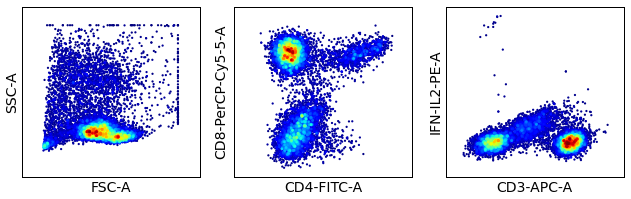

FCM Tutorials
=========

This Is a collection of tutorial on how to use python for automated cytometry analysis. Most of the tutorials make extensive use of the ``fcm`` package, and it is assumed that the reader is familiar with standard scientific Python modules such as ``numpy``, ``scipy``, ``matplotlib``, ``pandas`` etc.

The notes are written in ```multimarkdown ``` - I use the Marked app for processing the mulitmarkdown dialect. Unfortunately, this means that nicely formatted HTML needs to be manually processed - the Makefile generated HTML is ugly as the ```multimarkdown``` processor does not appear to support fenced code blocks. See ```README_swiss.html``` for what the HTML looks like as generated from Marked with the Swiss CSS applied.

Tutorial topics
------------

### Overview and example

As a taster, we show a reasonably complete example that performs exploratory analysis to identify antigen specific cell subsets in FCS files from an intracellular staining (ICS) assay.

We start by importing packages whose functionality we will need, and also set up some graphics parameters.

```
# import packages used
import sys
from glob import glob
import numpy as np, numpy.random as npr
import fcm, fcm.statistics as stats
from fcm.graphics import bilinear_interpolate
```

We then read the FCS files from the data directory, compensate using the spillover matrix in the FCS metadata and perform a cutom Logicle transform with w=1.0 using list comprehension.

```
xss = [fcm.loadFCS(f, auto_comp=True, transform='logicle', w=1.0) for f in glob('data/*fcs')]
```

We store a smaller subsample for exploratory analysis.

```
npts = 10000
yss = [xs.subsample(npts) for xs in xss]
```

Since we are plotting several scatter plots, we write a helper plotting function
```
# function for basic dot plot
def dotplot(xs, zs, dim, markers, sz=1):
    iz = np.argsort(zs)
    scatter(xs[:, dim[0]][iz], xs[:, dim[1]][iz], s=sz, c=zs[iz], edgecolors='none')
    xticks([])
    yticks([])
    xlabel(markers[dim[0]])
    ylabel(markers[dim[1]])
```

We can now inspect the subsampled contents of the first FCS file
```
# visually inspect the first file
dims = [(0,1), (3,4), (2,5)]
ncols = len(dims)
ys = yss[0]
figure(figsize=(panel_size*ncols, panel_size))
for k, dim in enumerate(dims):
    subplot(1, ncols, k+1)
    zs = bilinear_interpolate(ys[:, dim[0]], ys[:, dim[1]])
    dotplot(ys, zs, dim, parameter_names, sz=5)
tight_layout()
```

Running this code gives the following graphic



 2. Managing cytometry data
 3. Pre-processing data
 4. Exploratory data analysis
 5. Gating and thresholding
 6. Fitting statistical mixture models
 7. Normalizing data
 8. Subsampling data
 9. Aligning cell subsets
 10. Visualizing data
 11. Labeling cell subsets
 12. Building analysis pipelines
 13. Writing graphical user interfaces (GUI)
 14. Quality control

License
-------

<a rel="license" href="http://creativecommons.org/licenses/by/3.0/deed.en_US"></a><br />This work is licensed under a <a rel="license" href="http://creativecommons.org/licenses/by/3.0/deed.en_US">Creative Commons Attribution 3.0 Unported License</a>.

